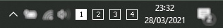

# Virtual Desktop Indicator

Virtual desktop indicator for system tray with light and dark theme, HiDPI support and easy switch between desktops.

*Dark theme screenshot*

## Special thanks

Special thanks to the user [zgdump](https://github.com/zgdump) for the original version.

## License

The app is distributed under [MIT License](https://github.com/DanieleMarrone/windows-virtualdesktopindicator/blob/master/LICENSE).
